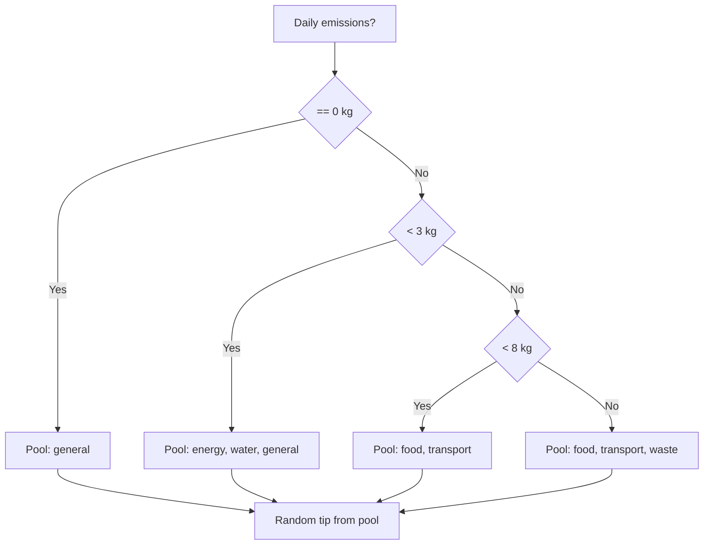

The environmental tips system surfaces contextual advice based on a user's daily emissions. Tips are grouped into six categories covering the main areas where individuals can reduce their carbon footprint. The system selects tips dynamically — the higher the user's daily emissions, the more targeted and direct the advice becomes.

## TypeScript interface

```typescript
export interface EnvironmentalTip {
  id: string
  category: "food" | "transport" | "energy" | "water" | "waste" | "general"
  title: string
  description: string
}
```

<ResponseField name="id" type="string" required>
  Unique identifier for the tip.
</ResponseField>

<ResponseField name="category" type="string" required>
  One of the six category strings. Determines which tip pool the item belongs to.
</ResponseField>

<ResponseField name="title" type="string" required>
  Short imperative headline displayed as the tip title in the UI.
</ResponseField>

<ResponseField name="description" type="string" required>
  One or two sentence explanation providing actionable detail.
</ResponseField>

## Categories

| Category | Focus area |
|----------|------------|
| `food` | Dietary choices that lower food-production emissions |
| `transport` | Switching to lower-emission travel modes |
| `energy` | Reducing electricity and heating consumption at home |
| `water` | Cutting water use to reduce heating and pumping energy |
| `waste` | Reducing landfill contribution through recycling and composting |
| `general` | Broader lifestyle habits that span multiple emission sources |

## Tip selection logic

The active tip pool is determined by the user's **total emissions for the current day** (in kg CO₂e). A tip is drawn at random from the applicable pool.

```
dailyEmissions == 0 kg    → general
dailyEmissions < 3 kg     → energy, water, general
dailyEmissions < 8 kg     → food, transport
dailyEmissions >= 8 kg    → food, transport, waste
```

<Info>
  When the user has not logged any activities yet (`0 kg`), only general tips are shown to avoid presenting irrelevant, category-specific advice.
</Info>

<Warning>
  The thresholds (3 kg and 8 kg) are compared against the **day's running total**, not a single activity. The pool is re-evaluated each time `getRandomTip()` is called.
</Warning>

### Selection flow



## Functions

### `getRandomTip()`

Returns a single tip selected at random from the pool that matches the user's current daily emissions level.

```typescript
export function getRandomTip(): EnvironmentalTip
```

This function reads the user's current daily emissions internally and applies the selection logic above. The returned tip changes on each call.

**Example**

```typescript
import { getRandomTip } from "@/lib/environmental-tips"

const tip = getRandomTip()
console.log(tip.title)       // "Reduce el consumo de carne roja"
console.log(tip.category)    // "food"
```

---

### `getTipsByCategory(category)`

Returns all tips that belong to the specified category.

```typescript
export function getTipsByCategory(
  category: EnvironmentalTip["category"]
): EnvironmentalTip[]
```

<ParamField path="category" type="string" required>
  One of: `"food"`, `"transport"`, `"energy"`, `"water"`, `"waste"`, `"general"`.
</ParamField>

**Example**

```typescript
import { getTipsByCategory } from "@/lib/environmental-tips"

const foodTips = getTipsByCategory("food")
foodTips.forEach(tip => console.log(tip.title))
// "Reduce el consumo de carne roja"
// "Compra productos locales"
// "Evita el desperdicio de alimentos"
// "Opta por proteinas vegetales"
// "Reduce los productos lacteos"
```

## All tips by category

<AccordionGroup>
  <Accordion title="Food tips">

  | Title | Description |
  |-------|-------------|
  | Reduce el consumo de carne roja | Opting for plant-based proteins or poultry significantly lowers meal-level emissions. |
  | Compra productos locales | Locally sourced produce travels shorter distances, reducing transport emissions. |
  | Evita el desperdicio de alimentos | Food that ends up in landfill produces methane; plan meals to avoid discarding ingredients. |
  | Opta por proteinas vegetales | Legumes and tofu carry a fraction of the emission factor of beef or cheese. |
  | Reduce los productos lacteos | Dairy production is a significant contributor to agricultural emissions. |

  </Accordion>

  <Accordion title="Transport tips">

  | Title | Description |
  |-------|-------------|
  | Usa transporte publico | City buses emit less than half the CO₂e per km of a solo car trip. |
  | Camina o usa bicicleta | Zero-emission options for short journeys under 5 km. |
  | Comparte viajes | Carpooling halves or thirds the per-person emission factor of a car. |
  | Planifica tus recorridos | Combining errands into one trip reduces total distance driven. |
  | Mantén tu vehiculo | A well-maintained engine burns fuel more efficiently, lowering emissions. |

  </Accordion>

  <Accordion title="Energy tips">

  | Title | Description |
  |-------|-------------|
  | Usa bombillas LED | LED bulbs consume up to 80% less electricity than incandescent alternatives. |
  | Desconecta aparatos | Standby power can account for 10% of home electricity use. |
  | Aprovecha la luz natural | Keeping blinds open during the day reduces reliance on artificial lighting. |
  | Ajusta el termostato | Lowering heating by 1°C can cut energy use by around 10%. |

  </Accordion>

  <Accordion title="Water tips">

  | Title | Description |
  |-------|-------------|
  | Duchas cortas | Reducing shower time by two minutes saves both water and water-heating energy. |
  | Repara fugas | A dripping tap can waste over 3,000 litres per year. |
  | Lava con carga completa | Running the washing machine only when full maximises efficiency per wash. |

  </Accordion>

  <Accordion title="Waste tips">

  | Title | Description |
  |-------|-------------|
  | Recicla correctamente | Proper sorting ensures materials are actually recycled rather than sent to landfill. |
  | Usa bolsas reutilizables | Single-use plastic bags require fossil fuels to produce and rarely get recycled. |
  | Evita el plastico de un solo uso | Reusable containers eliminate the production emissions of disposable packaging. |
  | Composta residuos organicos | Composting organic waste prevents methane emissions from anaerobic decomposition in landfill. |

  </Accordion>

  <Accordion title="General tips">

  | Title | Description |
  |-------|-------------|
  | Compra menos, elige mejor | Fewer, higher-quality purchases reduce manufacturing and disposal emissions. |
  | Planta arboles | Trees sequester carbon and improve local air quality. |
  | Educa a otros | Sharing knowledge multiplies the individual impact of behaviour change. |
  | Mide tu impacto | Tracking emissions over time is the first step to meaningful reduction. |

  </Accordion>
</AccordionGroup>
